<div align="center">


# Tabarak Electronics Kenya

### Custom WordPress + WooCommerce platform for [tabarakelectronics.co.ke](https://tabarakelectronics.co.ke/)

A fast, mobile-first electronics and home-appliance store for Nairobi and the rest of Kenya, with more than 2,000 products across TVs, refrigerators, cookers, washing machines, audio and small kitchen appliances. It is built on one parent theme, one child theme and one companion plugin.

\
\
\
\
\
\
\
\

[Live site](https://tabarakelectronics.co.ke/) · [Shop](https://tabarakelectronics.co.ke/shop/) · [Delivery & Installation](https://tabarakelectronics.co.ke/delivery-installation/) · [Installation guide](tabarak-electronics/INSTALLATION-GUIDE.md) · [Child theme docs](tabarak-electronics-child/README.md) · [Changelog](CHANGELOG.md)

</div>

---

\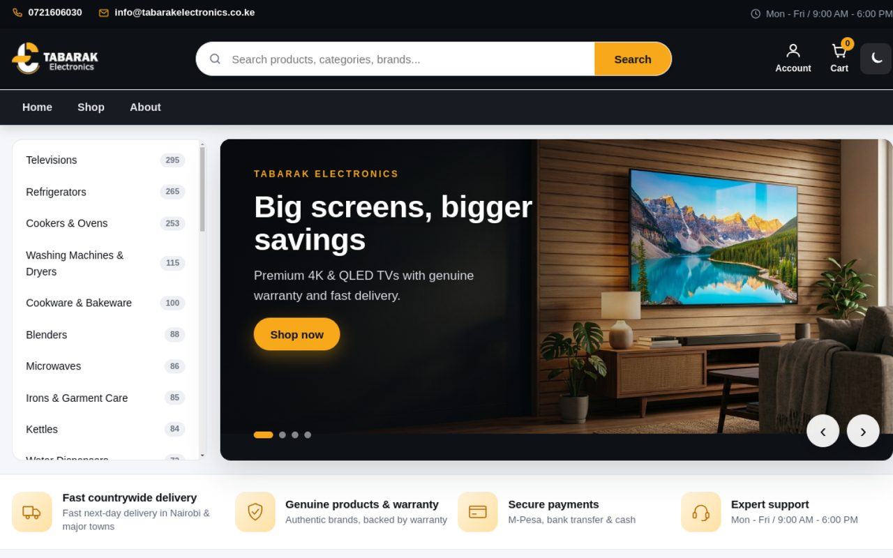

## Overview

Tabarak Electronics is a home-appliance and electronics retailer based at Nairobi Sky Mall, Luthuli Street. This repository contains the full custom platform behind the live store:

| Package | Folder | Version | Role |
| --- | --- | --- | --- |
| **Tabarak Electronics** (parent theme) | [`tabarak-electronics/`](tabarak-electronics) | 1.2.1 | Base layout, design tokens, header and footer, WooCommerce wrappers, Customizer, menus and widget areas |
| **Tabarak Electronics Child** (active theme) | [`tabarak-electronics-child/`](tabarak-electronics-child) | 1.10.1 | The storefront customers see: hero slider, category sidebar, product rails, brand strip, live search, shop filters, product trust panel, WhatsApp ordering, dark mode and mobile bottom navigation |
| **Tabarak Core** (plugin) | [`tabarak-core/`](tabarak-core) | 1.9.1 | Business logic that must survive a theme change: business settings, Brands taxonomy, structured data, policy shortcodes, checkout tweaks, Setup Wizard, security hardening and anti-spam |

> The themes control how the store looks. The plugin holds business data and rules, such as brands, business details and checkout settings, so they stay in place when a theme is updated or replaced. **The child theme is the active theme** on the live site; the parent stays installed so the child can inherit from it.

## Screenshots

| Shop with brand, price and stock filters | Category page with hero banner |
| --- | --- |
| \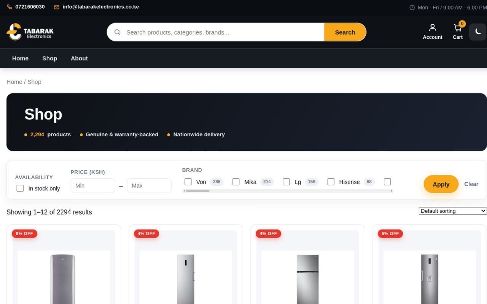 | \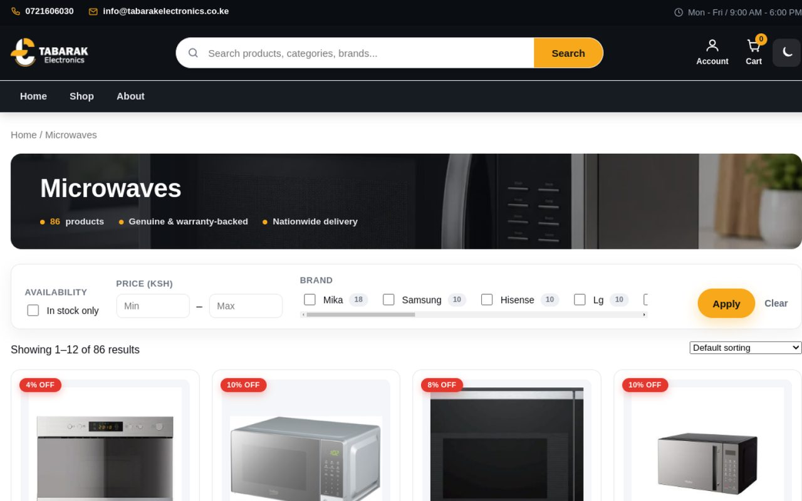 |

| Product page with WhatsApp ordering and trust panel | Mobile homepage |
| --- | --- |
| \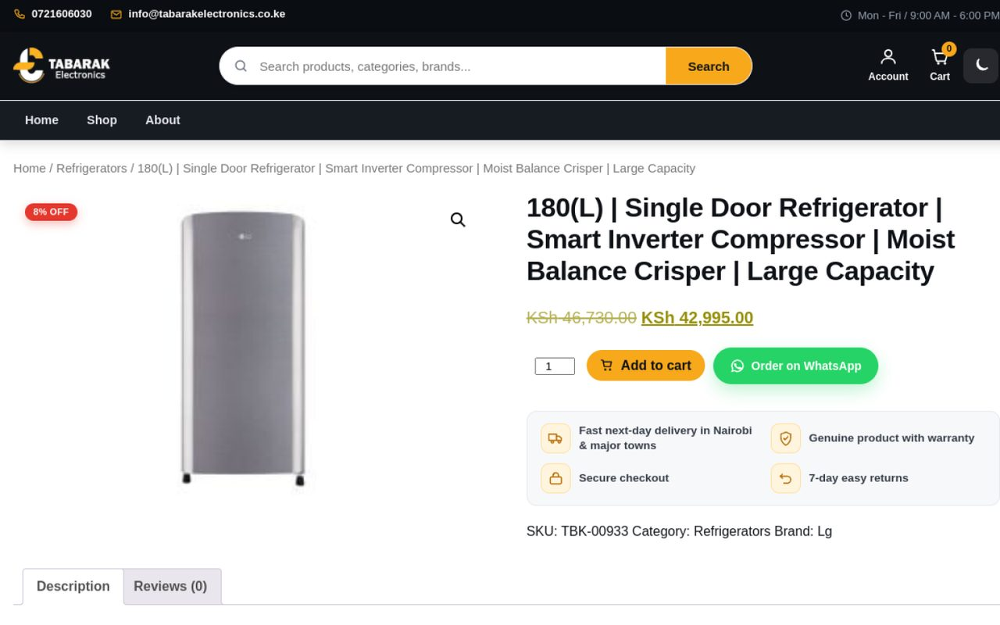 | <p align="center">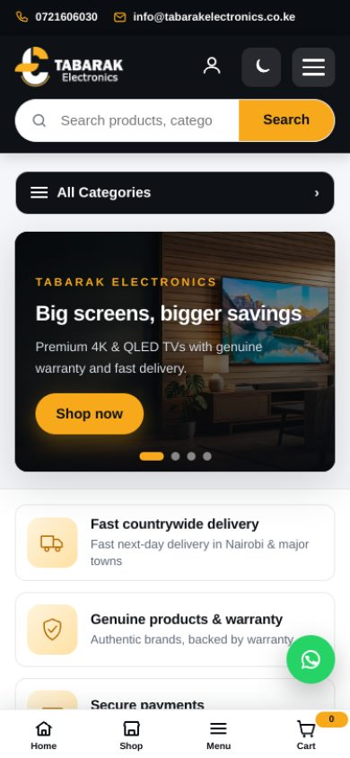</p> |

<sub>Screenshots taken from the live site in October 2026.</sub>

## Homepage hero slides

<table>
  <tr>
    <td align="center">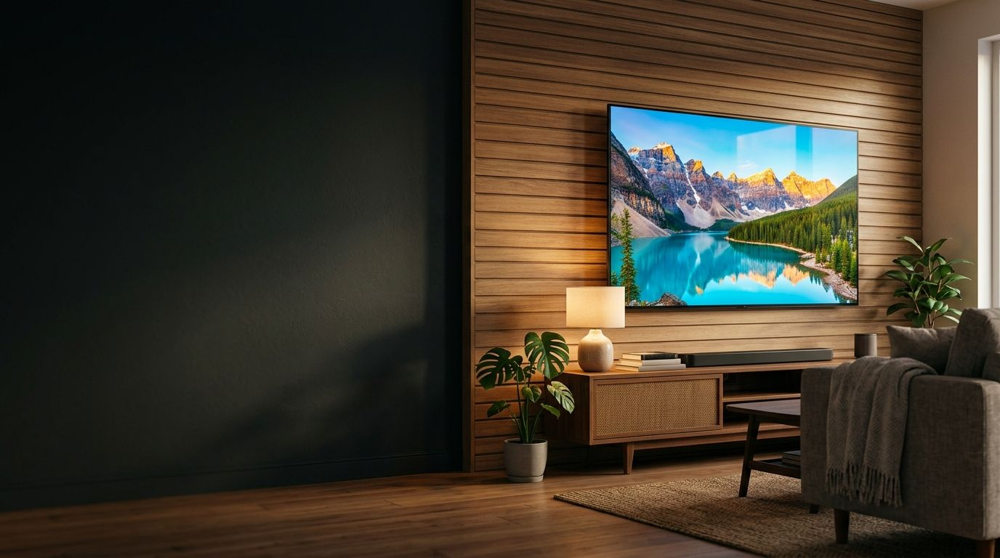<br><sub>Big screens, bigger savings</sub></td>
    <td align="center">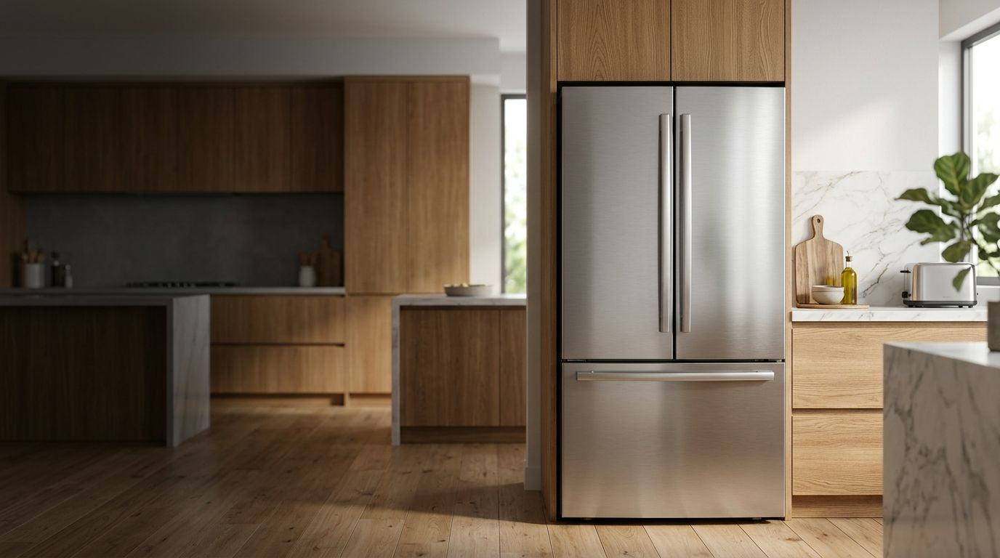<br><sub>Keep it cool, keep it fresh</sub></td>
    <td align="center">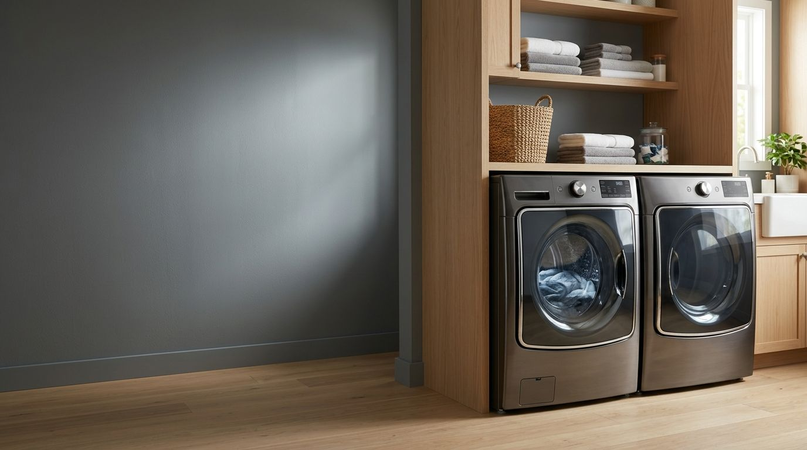<br><sub>Laundry made easy</sub></td>
    <td align="center">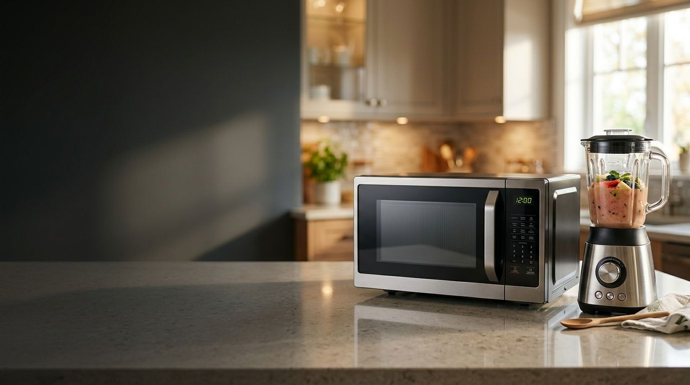<br><sub>Cook and blend in style</sub></td>
  </tr>
</table>

Each slide's image, title, subtitle and button link can be replaced under **Appearance > Customize > Homepage hero**.

## What customers can shop

| Area | Categories |
| --- | --- |
| **Screens & sound** | Televisions, Audio & Home Theatre |
| **Cooling** | Refrigerators, Freezers, Chillers & Coolers, Water Dispensers, Ice Makers, Air Conditioners, Fans |
| **Cooking** | Cookers & Ovens, Microwaves, Cooker Hoods & Extractors, Grills & BBQ, Pressure & Multi-Cookers, Deep Fryers, Air Fryers |
| **Laundry & care** | Washing Machines & Dryers, Dryers, Irons & Garment Care, Personal Care, Heaters |
| **Small kitchen** | Blenders, Juicers, Mixers, Food Processors, Kettles, Coffee Makers, Cookware & Bakeware, Dishwashers |

**Brands include:** Samsung, LG, Hisense, Sony, TCL, Haier, Beko, Bosch, Hotpoint, Midea, Smeg, Von, Mika, Ramtons, Kenwood, Tefal, De'Longhi, JBL, Black+Decker, Ariete, Nutricook, Simfer, Solstar and SCL.

## Key features

### Storefront (child theme)
- **Electronics-store layout:** dark header with a large product search, a scrollable category sidebar with live product counts, and a four-slide hero carousel
- **Trust strip:** countrywide delivery, genuine products with warranty, secure payments (M-Pesa, bank transfer and cash) and expert support
- **Smart product rails:** *Shop by category* tiles, category rows, brand strip and "new" badges, cached and rebuilt when the Customizer is saved
- **Live AJAX search** across products, categories and brands, with a nonce-protected endpoint
- **Shop and category filters:** in-stock only, price range (KSh) and brand checkboxes with counts, plus a category hero banner with product totals
- **Custom product cards:** lazy-loaded images, percentage-off sale badges, strike-through prices and a branded placeholder for products without photos
- **Product page:** *Order on WhatsApp* button next to *Add to cart*, delivery, warranty, secure-checkout and 7-day return trust panel, and a *Recently viewed* rail
- **Mobile-first UX:** bottom navigation (Home, Shop, Menu, Cart), *All Categories* drawer, floating WhatsApp button and a dark-mode toggle

### Business platform (Tabarak Core plugin)
| Module | What it does |
| --- | --- |
| **Business settings** | One **Tabarak** admin screen for phone, WhatsApp, email, hours, address and the checkout payment note. Feeds the `tabarak_business_info` filter used across the themes |
| **Brands taxonomy** | `tabarak_brand` taxonomy for products, with brand images and `/brand/<slug>/` archive pages |
| **Structured data** | JSON-LD for Organization and ElectronicsStore in `wp_head` |
| **Policy shortcodes** | `[tabarak_trust_badges]`, `[tabarak_return_policy]`, `[tabarak_delivery]`, `[tabarak_shipping]`, `[tabarak_about]` and `[tabarak_contact]` |
| **Kenyan checkout** | Simplified checkout and address fields, plus a payment note explaining M-Pesa, cash and bank transfer, and that each order is confirmed by call or WhatsApp |
| **Setup Wizard** | Installs WooCommerce and recommended plugins, then creates About, Contact, FAQs, Delivery & Installation, Warranty & Service, Financing, Returns, Shipping, Privacy and Terms pages. It skips pages that already exist |
| **Hardening** | Disables XML-RPC and pingbacks, blocks author scans, restricts user REST endpoints, sends security headers, shows generic login errors and throttles failed logins |
| **Anti-spam** | Honeypot fields on comments, registration and checkout, spam-email blocking and product-only reviews |
| **Speed trimming** | Removes emoji scripts, trims unused assets and slows the Heartbeat API |

> **Data safety:** none of the code creates, renames or deletes products or product categories. All shop data access is read-only. The only content it can create is WordPress pages, and only when you run the Setup Wizard.

### Performance, SEO, accessibility and security
- **Performance:** system font stack (no web-font requests), vanilla JavaScript with no jQuery dependency in the theme, lazy-loaded images, compressed hero images, cached homepage rows and a reduced Heartbeat
- **SEO:** Organization and ElectronicsStore JSON-LD, clean category and brand URLs, breadcrumbs and semantic headings
- **Accessibility:** skip link, visible `:focus-visible` outlines, ARIA labels on menus, cart and floating buttons, and semantic landmarks
- **Security:** escaped output, sanitised Customizer input, `ABSPATH` guards in every file, nonce-protected AJAX, plus ready-to-use `.htaccess` and `robots.txt` hardening in [`tabarak-electronics-child/security/`](tabarak-electronics-child/security)

## Architecture

### How the three packages fit together

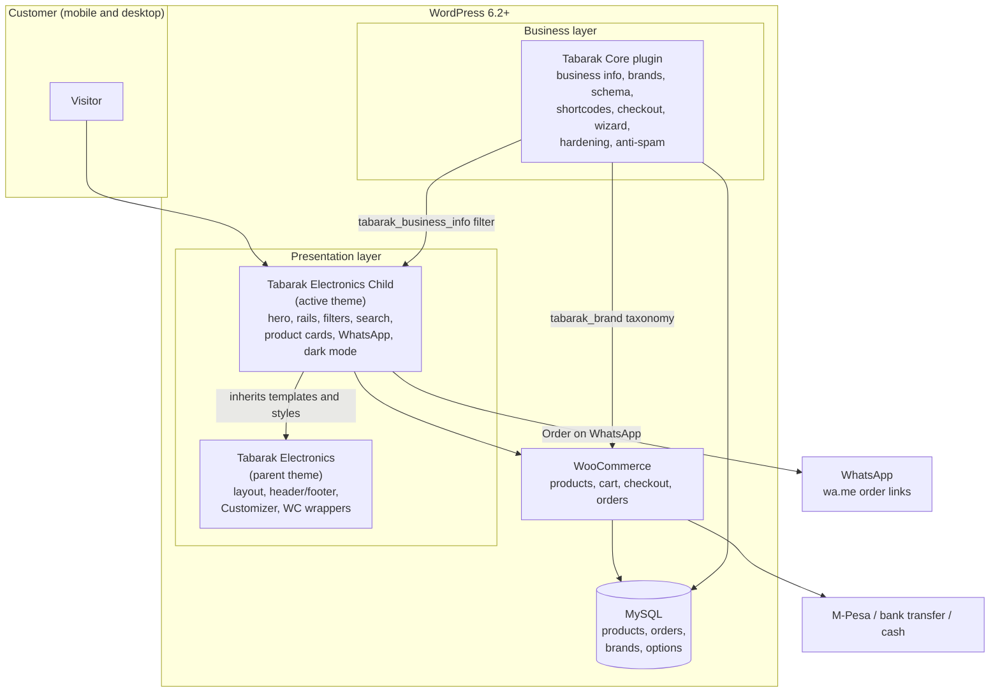

### Request flow for the homepage

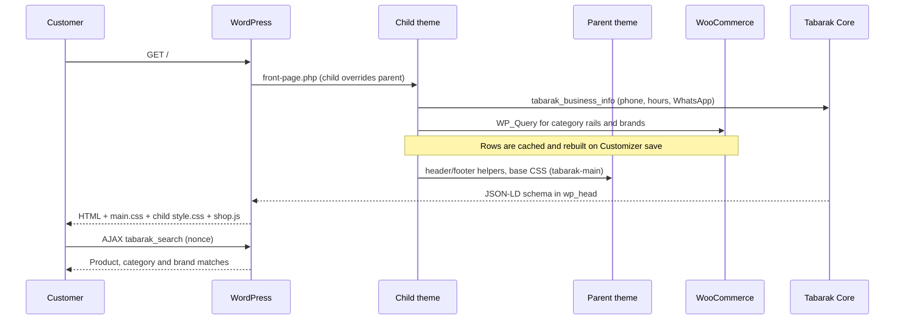

### Asset loading order

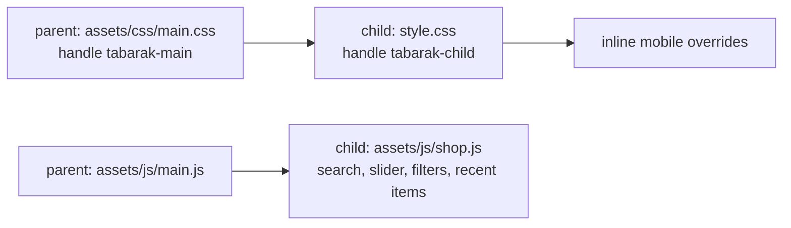

## Project structure

```text
.
├── README.md                       # You are here
├── CHANGELOG.md                    # Release notes for all three packages
├── docs/
│   └── screenshots/                # README images taken from the live site
├── tabarak-electronics/            # Parent theme
│   ├── assets/
│   │   ├── css/main.css            # Design system and base components
│   │   ├── images/logo.png
│   │   └── js/main.js              # Mobile menu and back-to-top
│   ├── inc/
│   │   ├── setup.php               # Theme supports, menus, image sizes, widget areas
│   │   ├── enqueue.php             # Styles and scripts
│   │   ├── template-functions.php  # Business info, helpers, menu fallback
│   │   ├── customizer.php          # Top-bar text and accent colour
│   │   └── woocommerce.php         # Shop wrappers, grid, cart fragments
│   ├── template-parts/             # Post, card, search and empty-state partials
│   ├── front-page.php  header.php  footer.php  page.php  single.php
│   ├── archive.php  search.php  searchform.php  404.php  comments.php  sidebar.php
│   ├── theme.json  style.css  screenshot.png
│   └── INSTALLATION-GUIDE.md
├── tabarak-electronics-child/      # Child theme (active)
│   ├── assets/
│   │   ├── images/                 # Logo, hero slides, product placeholder
│   │   └── js/shop.js              # Live search, hero slider, filters, recently viewed
│   ├── security/                   # .htaccess and robots.txt hardening snippets
│   ├── front-page.php              # Electronics-store homepage
│   ├── header.php  footer.php  searchform.php
│   ├── functions.php               # Cards, rails, filters, search, Customizer, performance
│   ├── style.css                   # Child design system (loads after the parent)
│   ├── screenshot.png
│   └── README.md
└── tabarak-core/                   # Companion plugin
    ├── tabarak-core.php            # Bootstrap
    ├── includes/
    │   ├── class-tabarak-core.php          # Business info, brands, schema, shortcodes, checkout
    │   ├── class-tabarak-setup-wizard.php  # Plugin installer and page creator
    │   └── class-tabarak-hardening.php     # Security, anti-spam and speed
    ├── assets/js/brand-admin.js    # Brand image uploader
    └── readme.txt
```

## Requirements

| Component | Version |
| --- | --- |
| WordPress | 6.2 or later (tested up to 6.6) |
| PHP | 7.4 or later (tested on 8.3) |
| WooCommerce | 8 or later (required for the shop) |
| Recommended | LiteSpeed Cache, Yoast SEO, an M-Pesa WooCommerce gateway |

## Installation

1. **Parent theme:** zip `tabarak-electronics/` and upload it under **Appearance > Themes > Add New > Upload Theme**. Do not activate it yet.
2. **Child theme:** zip and upload `tabarak-electronics-child/`, then **activate *Tabarak Electronics Child***.
3. **Plugin:** zip `tabarak-core/`, upload it under **Plugins > Add New > Upload Plugin** and activate **Tabarak Core**.
4. Open **Tabarak > Setup Wizard** to install WooCommerce and the recommended plugins and create the store pages.
5. In WooCommerce, set the currency to **KES** and the country to **Kenya**.
6. Assign menus under **Appearance > Menus** (Primary, Mobile, Footer, Top Bar).
7. Re-save **Settings > Permalinks** once so category and brand URLs resolve.

```bash
# Build upload ZIPs from the repository root
zip -r tabarak-electronics.zip tabarak-electronics
zip -r tabarak-electronics-child.zip tabarak-electronics-child
zip -r tabarak-core.zip tabarak-core
```

> **Deployment note:** commits to this repo do **not** deploy automatically. Upload the changed theme or plugin folders to hosting (ZIP upload, File Manager or FTP) for updates to go live.

Full guide: [INSTALLATION-GUIDE.md](tabarak-electronics/INSTALLATION-GUIDE.md)

## Configuration without code

| Where | What you can change |
| --- | --- |
| **Tabarak** (admin menu) | Business name, phone, WhatsApp, email, hours, address, checkout payment note |
| **Appearance > Customize > Homepage hero** | Four slides: image, title, subtitle and button link |
| **Appearance > Customize > Announcement** | Top-bar announcement text |
| **Appearance > Customize > Homepage rows** | Which categories and brands appear on the homepage |
| **Appearance > Customize > Colors** | Accent colour (default `#f7a81b`) |
| **Products > Brands** | Brand names and logos |

### Design tokens

| Token | Value | Use |
| --- | --- | --- |
| `--t-accent` | `#f7a81b` | Buttons, highlights, badges |
| `--t-dark` | `#0e1116` | Header, hero and footer background |
| `--t-muted` | `#5e6675` | Secondary text |
| `--t-bg` | `#f5f6f9` | Section backgrounds |
| `--t-radius` | `14px` | Cards and panels |

## Extending

Add all customisations to `tabarak-electronics-child/` so parent updates never overwrite them.

```php
// Override business details without touching parent or plugin files.
add_filter( 'tabarak_business_info', function ( $info ) {
    $info['phone']    = '0721606030';
    $info['whatsapp'] = '254721606030';
    $info['hours']    = 'Mon - Fri / 9:00 AM - 6:00 PM';
    return $info;
} );
```

Every theme function is wrapped in `function_exists()`, so you can redefine any of them in the child. To override a template, copy it from the parent into the child using the same path.

## Troubleshooting

| Problem | Fix |
| --- | --- |
| Products imported but the homepage is empty | **WooCommerce > Status > Tools:** run *Regenerate product lookup tables*, *Recount terms* and *Clear transients* |
| Category or brand links return 404 | **Settings > Permalinks** and click **Save** |
| Homepage rows look out of date | Open the Customizer and click **Publish** to rebuild the cached rows |
| Changes on GitHub are not on the site | Upload the updated folder to hosting (see the deployment note) |

## Business

**Tabarak Electronics Kenya**
Nairobi Sky Mall Building, Luthuli Street, Nairobi Central, Kenya
Phone: [0721 606 030](tel:0721606030) · Email: [info@tabarakelectronics.co.ke](mailto:info@tabarakelectronics.co.ke)
Hours: Mon - Fri, 9:00 AM - 6:00 PM

## Credits

Designed, developed and maintained by **[Pimofy Digital](https://github.com/moselanto)**, Nairobi.

## License

GNU General Public License v2 or later. See the [license text](http://www.gnu.org/licenses/gpl-2.0.html).

<sub>Product names, logos and brands belong to their respective owners.</sub>
