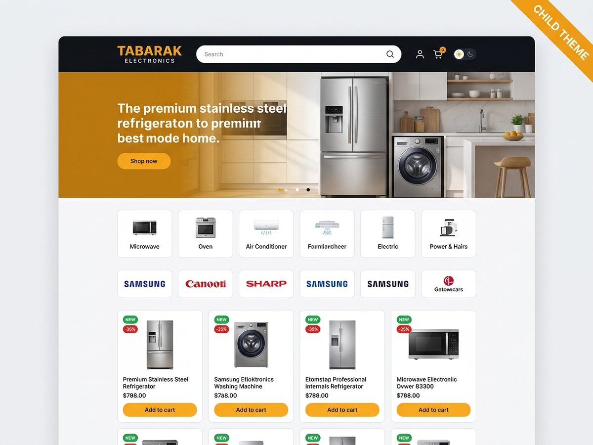

# Tabarak Electronics Child

The **active theme** on [tabarakelectronics.co.ke](https://tabarakelectronics.co.ke/). It inherits from the parent theme `tabarak-electronics` and holds every site-specific design and storefront feature, so parent updates never overwrite them.

\

| | |
| --- | --- |
| **Version** | 1.11.0 |
| **Parent (Template)** | `tabarak-electronics` |
| **Requires** | WordPress 6.2+, PHP 7.4+, WooCommerce 8+ |
| **Text domain** | `tabarak-electronics-child` |

## What it adds

| Feature | Where |
| --- | --- |
| Electronics-store homepage: category sidebar, hero slider, trust strip, category tiles, product rails, brand strip | `front-page.php`, `functions.php` |
| Dark header with large search, account and cart, dark-mode toggle | `header.php` |
| Footer with contact, policies and mobile bottom navigation | `footer.php` |
| Live AJAX product, category and brand search | `searchform.php`, `tabarak_ajax_search()`, `assets/js/shop.js` |
| Shop filters: in stock, price range, brand | `tabarak_child_filter_ui()`, `tabarak_child_filter_query()` |
| Category hero banner with product count | `tabarak_child_category_hero()` |
| Product cards with sale percentage badge and placeholder image | `tabarak_child_product_card()`, `tabarak_child_sale_flash()` |
| *Order on WhatsApp* button and trust panel on product pages | `tabarak_child_wa_after_cart()`, `tabarak_child_single_trust()` |
| Recently viewed products | `tabarak_child_recent_container()`, `shop.js` |
| Performance and security trims | `tabarak_child_perf_security()`, `tabarak_child_perf_cpu()` |
| Server hardening snippets | `security/` |

## Customizer

- **Announcement:** top-bar text
- **Homepage hero:** four slides (image, title, subtitle, link)
- **Homepage rows:** categories and brands shown on the homepage (cache is rebuilt on save)

## Install order

1. Install the parent theme `tabarak-electronics` and keep it installed.
2. Upload this folder as a ZIP under **Appearance > Themes > Add New > Upload Theme**.
3. Activate **Tabarak Electronics Child**.
4. Install and activate the **Tabarak Core** plugin for business info, brands and schema.

## Customising safely

- Add CSS to `style.css`. It loads after the parent stylesheet (`tabarak-main`).
- Add PHP hooks and filters to `functions.php`. All functions are wrapped in `function_exists()`.
- To override a parent template, copy it here with the same path and edit the copy.
- Apply the files in `security/` on the server: `root-htaccess-block.txt` goes in the site root `.htaccess`, `uploads-htaccess.txt` in `wp-content/uploads/.htaccess`, and `robots.txt` in the site root.

See the [main README](../README.md) for the full architecture.
